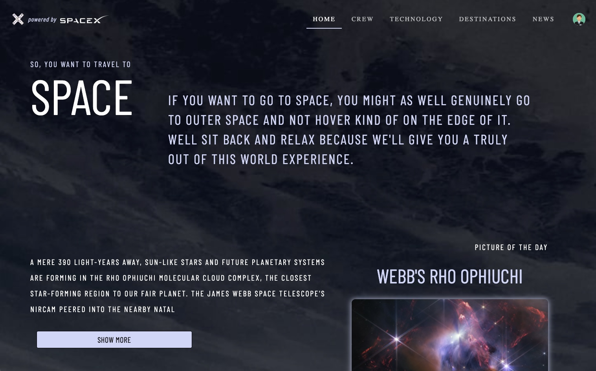
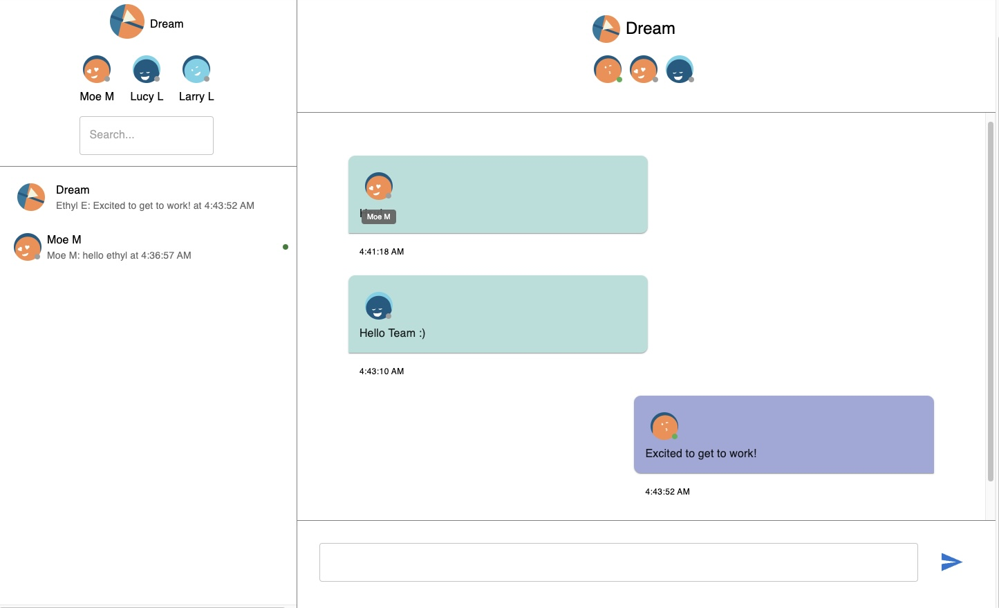

---

<h1 align="center">Welcome to Travis Wager's Portfolio 👨‍💻</h1>

 

Hello and welcome! I'm Travis, a passionate Software Engineer with proficiency in both front-end and back-end development. My tech toolkit includes HTML, CSS, JavaScript, React, Redux, Node.js, Express, Postgres, SQL, Sequelize, and Git. 

Through my projects, you will discover my dedication and skills applied across the spectrum of Fullstack Web Development. Each one is a demonstration of my technical capabilities, my understanding of user-centric design, and my ability to create scalable and maintainable software solutions.

So, please, take a look around. I hope you enjoy exploring my work as much as I enjoyed building it!

---

<h2 align="center">💼 Featured Projects</h2>

### [🚀 E-Commerce Space Travel](https://github.com/wagertg/stackathon)

Created an immersive platform catering to the needs of space enthusiasts. This platform lets users plan and book interplanetary journeys, taking the E-commerce experience to another galaxy!

---

### [📊 Project Managment App](https://github.com/wagertg/capstone)

Contributed to the development of a robust project management tool designed to enhance team collaboration and task organization. I spearheaded the creation of a real-time messaging system and live notifications feature, significantly improving intra-team communication and ensuring instant updates.

---

### [🎓 Campus and Student Admin Dashboard Project](https://github.com/wagertg/edu-dashboard)

Engineered an all-encompassing admin dashboard to aid in administrative productivity and content management, making the daunting task of school administration a breeze. This intuitive and user-friendly dashboard is perfect for streamlining operations and making processes more efficient.

---

Let's connect if you have any opportunities, need more information, or simply want to say hi! I look forward to hearing from you.
